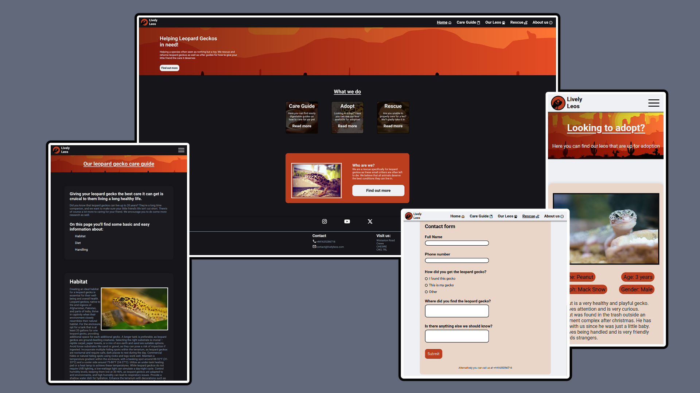

# Lively Leos
## A rescue for leopard geckos

Livelyleos is a rescue dedicated to leopard geckos. Not only do they rehome these reptiles, but they also make sure that they are safe and sound in their new home, provide guides and education for stores and employees on how to properly keep the little creatures as pet stores tend to have enclosures that are way to small as well as dangeround substrate. Livelyleos main pitches are their guides, adoptions and rescues, taking in both abandoned pets as well as those that can't be kept anymore for various reasons such as financial trouble, floodings, busy owners and more. Livelyleos provide veterinary care to these unfortunate lizards in order to make sure they're healthy once they get to their new owners.

The rescue is made up from volunteers who are passionate about the well being of these geckos, including veterinarians and long time owners.

## [Link to website](https://zoten64.github.io/livelyleosrescue/)

## Content:

## User stories

As a new user of the page I want clear navigation to make it easy to find what I'm looking for
As a vision impaired user I want a website with high contrast colors to make it easier to read

## Technologies and tools
**Languages**
- HTML
- CSS

**Tools**
- Git/github
- Visual Studio Code
- Google Fonts
- Google Fonts Icons
- Font Awesome
- Figma
- Inkscape
- Real Favicon Generator
- Happy Hues
- Firefox dev tools
- Chrome dev tools (Briefly)

## Wireframes

Home

Guide

Our Leos

Rescue

About

## Validation and testing

HTML Validation results

CSS Validation results

**Other tests**
- I have tested the website using both firefox and chrome
- I have tested the website on my own phone to make sure everything runs smoothly there
- I have used dev tools to make sure everything is responsive and looks good on all reasonable sizes
- I have used firefox dev tools to make sure everything looks as it should on both light and dark mode

## Credits
**Images**
- [Hero image by Firkin on openclipart](https://openclipart.org/detail/306640/desert-at-dusk) under the [Creative Commons Zero 1.0 Public Domain License](https://creativecommons.org/publicdomain/zero/1.0/). Colors modified and vectors simplified in inkscape

- [404 Gecko image by Lucile Elville on Pexels](https://www.pexels.com/sv-se/foto/djur-odla-reptil-leopard-gecko-5475202/) (Unknown licence, [ToS here](https://www.pexels.com/license/))

- [Habitat gecko image by unknown on rawpixel](https://www.rawpixel.com/image/6023521/photo-image-public-domain-nature-free) under the [Creative Commons CC0 1.0 Deed](https://creativecommons.org/publicdomain/zero/1.0/) licence

- [Hornworm image by unknown on Pxhere](https://pxhere.com/sv/photo/773371) under the [Creative Commons Zero (CC0)](https://creativecommons.org/public-domain/cc0/) licence

- [Handling gecko image by Christopher Conde on Pexels](https://www.pexels.com/photo/close-up-shot-of-a-person-holding-a-leopard-gecko-8162439/) (Unknown licence, [ToS here](https://www.pexels.com/license/))

- [Index page gecko by Liliana Saeb on Wikimedia Commons](https://commons.wikimedia.org/wiki/File:Leopard_Gecko_%2846757940%29.jpeg) under the [Creative Commons Attribution 3.0 unported](https://creativecommons.org/licenses/by/3.0/deed.en) licence

- [Index Care Guide redirect gecko by unknown on Pxhere](https://pxhere.com/sv/photo/749123) under the [Creative Commons Zero (CC0)](https://creativecommons.org/public-domain/cc0/) licence

- [Index adopt rediect gecko by Christian von Faber-Castell on Wikimedia Commons](https://commons.wikimedia.org/wiki/File:EUBLEPHARIS-MACULARIUS_Leopard-Gecko_Leopardgecko_201705276003.jpg) under the [Creative Commons CC0 4.0 Deed](https://creativecommons.org/publicdomain/zero/1.0/) licence

- [Index rescue redirect gecko by Ryan Somma on Wikimedia Commons](https://commons.wikimedia.org/wiki/File:Leopard_Gecko,_Eublepharis_macularius.jpg) under the [Creative Commons Attribution 2.0 Generic](https://creativecommons.org/licenses/by/2.0/deed.en) licence

- [Peanut gecko on the 'our geckos' page by Pixabay on stockvault](https://www.stockvault.net/photo/236155/gecko) under the [Creative Commons CC0 1.0 Deed](https://creativecommons.org/publicdomain/zero/1.0/) licence

- [Iggy gecko on the 'our geckos' page by Kuribo on Flickr](https://www.flickr.com/photos/kuribo/2351182047) under the [Creative Commons Attribution 2.0 Generic](https://creativecommons.org/licenses/by/2.0/deed.en) licence

- [Dex gecko on the 'our geckos' page by Fungur Guy on Wikimedia Commons](https://de.wikipedia.org/wiki/Datei:Leopard_gecko_(Eublepharis_macularius),_Entomica_2.jpg) under the [Creative Commons CC0 4.0 Deed](https://creativecommons.org/publicdomain/zero/1.0/) licence

- Logo by me using clip studio paint and inkscape
