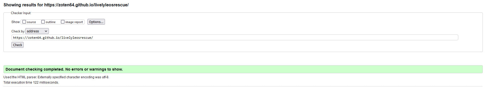

# Lively Leos
## A rescue for leopard geckos

Livelyleos is a rescue dedicated to leopard geckos. Not only do they rehome these reptiles, but they also make sure that they are safe and sound in their new home, provide guides and education for stores and employees on how to properly keep the little creatures as pet stores tend to have enclosures that are way to small as well as dangeround substrate. Livelyleos main pitches are their guides, adoptions and rescues, taking in both abandoned pets as well as those that can't be kept anymore for various reasons such as financial trouble, floodings, busy owners and more. Livelyleos provide veterinary care to these unfortunate lizards in order to make sure they're healthy once they get to their new owners.

The rescue is made up from volunteers who are passionate about the well being of these geckos, including veterinarians and long time owners.

## [Link to website](https://zoten64.github.io/livelyleosrescue/)

## Table of Contents:

## Goals and target audience

The goal of the project was to make a website that is useful for both new leopard gecko owners and long time ones as well as showing off the leopard geckos for those looking to adopt one. Another goal that I developed later was to provide a seperate page dedicated to rescue info and a form where you can contact the rescue for help/sending the gecko to them. 

I wanted to make the website both simple, not overwhelming and easy on the eyes as well as accessible to those with visual impairments and those who use keyboards to navigate. The website features easy to digest info about care and encourages the user to do more research on the topic as well. 

The target audience is very obvious. It's for those looking to adopt a leopard gecko or looking for a rescue to hand a leopard gecko over to. 

## Design

For the design I wanted to implement both a light mode and a dark mode for the site. I visited [Happy Hues](https://www.happyhues.co/) for a color pallette. What I did was I chose [this pallette](https://www.happyhues.co/palettes/9) and modified it slightly. I removed the pink color and kept the rest. For dark mode i took the colors from [this pallette](https://www.happyhues.co/palettes/13), but removed the accent colors to keep the same orange as light mode. I ended up changing the accent color from #ff8e3c to #bb3e1f (Current color that you see in the pallette) to make it contrast more with the text for better visibility.

**Light mode color pallette:**

**Dark mode color pallette**

For the design and layout I took inspiration from [this youtube video](https://www.youtube.com/watch?v=g0db5kA4BfQ&list=PL1abJ21nmMp82I9AUCc0ZKEe5NVgNyWGt&index=1&t=177s).

The font used on the whole page was [Roboto from google fonts.](https://fonts.google.com/specimen/Roboto)

## Features

### Sitewide

**Lightmode/Darkmode**

The site has a light and dark mode depending on the users preferences set in their settings

**Fully responsive navbar**
The navbar is fully responsive. It scales with the site and when there's too little space it turns into a hamburger menu

**Hover effects on navitems**

**Fully responsive footer with social media links, contact info and location**

**Social media hover effects**

### Home page

**Hero that states the purpose of the website**

**Redirect buttons of the 3 most important features**

**An about us summary**

### Care Guide page

**Animated list of links to jump to a specific section**

**Sections that adapt to the content**

### Our Leos page

**Sections with information on a specific leopard gecko**

**Contact Form**

### Rescue page 

**Text container with information**

**Contact Form with custom radio buttons**

### About us page

**Information about the rescue**

## Bugs and fixes

## User stories

- As a new user of the page I want clear navigation to make it easy to find what I'm looking for ✅
- As a vision impaired user I want a website with high contrast colors to make it easier to read ✅
- As a mobile user I want a website that is responsive and easy to navigate on mobile ✅
- As a desktop user I want a website that is responsive and easy to navigate on desktop ✅
- As a visually impaired user I want a website that can easilly be accessed with a screen reader ✅

- As an enthusiast looking for a new pet I want a website where I can adopt a leopard gecko from a responsible source ✅
- As someone who has found an abandoned leopard gecko I want to find information on what to do now ✅
- As someone who has found an abandoned leopard gecko I want to be able to easily contact a rescue as I do not have the ability/time to care for it myself ✅
- As someone who can no longer care for my leopard gecko I want a way to easily contact a place where I can be sure it will be taken care of properly ✅

- As the owner I want my website that displays all the geckos for adoption to heighten the chances of a rehoming ✅
- As the owner I want my website to have easy to understand care guides for everyone to reduce the amount of people mistreating their pet ✅
- As the owner I want my website to have easy ways to contact us for our services ✅

## Technologies and tools
**Languages**
- HTML
- CSS

**Tools**
- Git/github
- Visual Studio Code
- Google Fonts
- Google Fonts Icons
- Font Awesome
- Figma
- Inkscape
- Real Favicon Generator
- Happy Hues
- Firefox dev tools
- Chrome dev tools (Briefly)

## Wireframes

Home

Guide

Our Leos

Rescue

About

## Validation and testing

HTML Validation results (no errors)

CSS Validation results (no errors)

**Other tests**
- I have tested the website using both firefox and chrome
- I have tested the website on my own phone to make sure everything runs smoothly there
- I have used dev tools to make sure everything is responsive and looks good on all reasonable sizes
- I have used firefox dev tools to make sure everything looks as it should on both light and dark mode

## Deployment

Deployed on github pages. [Link to website](https://zoten64.github.io/livelyleosrescue/)
The steps taken to deploy is:
- Go to the repository
- Find the settings tab
- Go to pages
- Click source and choose "Deploy from branch"
- Choose Main as the branch and click save
- Wait a few minutes while github compiles the page
- Click the link at the top of the page to go to your website

## Credits

**Images**

- [Hero image by Firkin on openclipart](https://openclipart.org/detail/306640/desert-at-dusk) under the [Creative Commons Zero 1.0 Public Domain License](https://creativecommons.org/publicdomain/zero/1.0/). Colors modified and vectors simplified in inkscape

- [404 Gecko image by Lucile Elville on Pexels](https://www.pexels.com/sv-se/foto/djur-odla-reptil-leopard-gecko-5475202/) (Unknown licence, [ToS here](https://www.pexels.com/license/))

- [Habitat gecko image by unknown on rawpixel](https://www.rawpixel.com/image/6023521/photo-image-public-domain-nature-free) under the [Creative Commons CC0 1.0 Deed](https://creativecommons.org/publicdomain/zero/1.0/) licence

- [Hornworm image by unknown on Pxhere](https://pxhere.com/sv/photo/773371) under the [Creative Commons Zero (CC0)](https://creativecommons.org/public-domain/cc0/) licence

- [Handling gecko image by Christopher Conde on Pexels](https://www.pexels.com/photo/close-up-shot-of-a-person-holding-a-leopard-gecko-8162439/) (Unknown licence, [ToS here](https://www.pexels.com/license/))

- [Index page gecko by Liliana Saeb on Wikimedia Commons](https://commons.wikimedia.org/wiki/File:Leopard_Gecko_%2846757940%29.jpeg) under the [Creative Commons Attribution 3.0 unported](https://creativecommons.org/licenses/by/3.0/deed.en) licence

- [Index Care Guide redirect gecko by unknown on Pxhere](https://pxhere.com/sv/photo/749123) under the [Creative Commons Zero (CC0)](https://creativecommons.org/public-domain/cc0/) licence

- [Index adopt rediect gecko by Christian von Faber-Castell on Wikimedia Commons](https://commons.wikimedia.org/wiki/File:EUBLEPHARIS-MACULARIUS_Leopard-Gecko_Leopardgecko_201705276003.jpg) under the [Creative Commons CC0 4.0 Deed](https://creativecommons.org/publicdomain/zero/1.0/) licence

- [Index rescue redirect gecko by Ryan Somma on Wikimedia Commons](https://commons.wikimedia.org/wiki/File:Leopard_Gecko,_Eublepharis_macularius.jpg) under the [Creative Commons Attribution 2.0 Generic](https://creativecommons.org/licenses/by/2.0/deed.en) licence

- [Peanut gecko on the 'our geckos' page by Pixabay on stockvault](https://www.stockvault.net/photo/236155/gecko) under the [Creative Commons CC0 1.0 Deed](https://creativecommons.org/publicdomain/zero/1.0/) licence

- [Iggy gecko on the 'our geckos' page by Kuribo on Flickr](https://www.flickr.com/photos/kuribo/2351182047) under the [Creative Commons Attribution 2.0 Generic](https://creativecommons.org/licenses/by/2.0/deed.en) licence

- [Dex gecko on the 'our geckos' page by Fungur Guy on Wikimedia Commons](https://de.wikipedia.org/wiki/Datei:Leopard_gecko_(Eublepharis_macularius),_Entomica_2.jpg) under the [Creative Commons CC0 4.0 Deed](https://creativecommons.org/publicdomain/zero/1.0/) licence

- Logo by me using clip studio paint and inkscape

**Content**

- Social media icons from [Font Awesome](https://fontawesome.com/)

- Other icons from [Google Fonts icon section](https://fonts.google.com/icons)

- Font from [Google Font](https://fonts.google.com/)

- Some colors taken from [Happy hues](https://www.happyhues.co/palettes/9), modified