# Lively Leos
## A rescue for leopard geckos

Livelyleos is a rescue dedicated to leopard geckos. Not only do they rehome these reptiles, but they also make sure that they are safe and sound in their new home, provide guides and education for stores and employees on how to properly keep the little creatures as pet stores tend to have enclosures that are way to small as well as dangeround substrate. Livelyleos main pitches are their guides, adoptions and rescues, taking in both abandoned pets as well as those that can't be kept anymore for various reasons such as financial trouble, floodings, busy owners and more. Livelyleos provide veterinary care to these unfortunate lizards in order to make sure they're healthy once they get to their new owners.

The rescue is made up from volunteers who are passionate about the well being of these geckos, including veterinarians and long time owners.

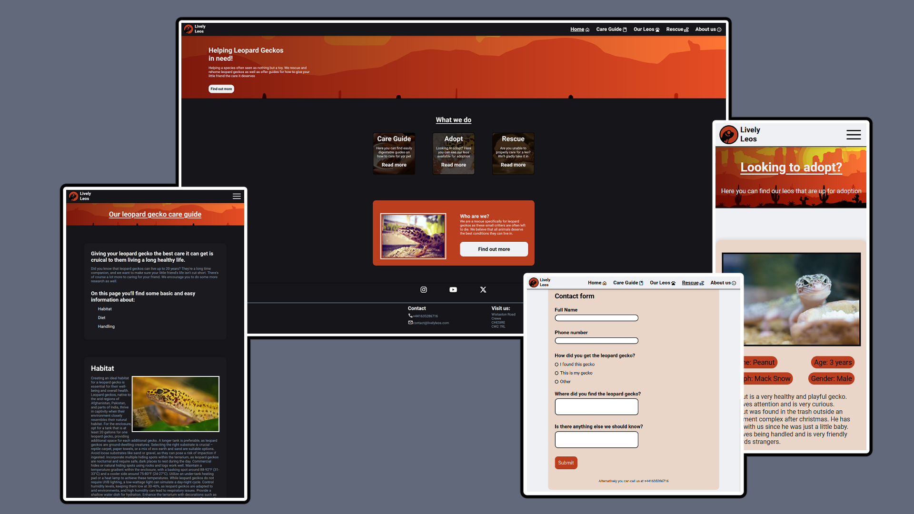

## [Link to website](https://zoten64.github.io/livelyleosrescue/)

## Table of Contents:

* [Goals and target audience](#goals-and-target-audience)
* [Design](#design)
* [User stories](#user-stories)
* [Features](#features)
    * [Sitewide](#sitewide)
    * [Home page](#home-page)
    * [Care Guide Page](#care-guide-page)
    * [Our Leos Page](#our-leos-page)
    * [Rescue page](#rescue-page)
    * [About us page](#about-us-page)
    * [Other](#other)
* [Bugs and fixes](#bugs-and-fixes)
* [Technologies and tools](#technologies-and-tools)
* [Wireframes](#wireframes)
* [Validation and testing](#validation-and-testing)
* [Deployment](#deployment)
* [Credits](#credits)

## Goals and target audience

The goal of the project was to make a website that is useful for both new leopard gecko owners and long time ones as well as showing off the leopard geckos for those looking to adopt one. Another goal that I developed later was to provide a seperate page dedicated to rescue info and a form where you can contact the rescue for help/sending the gecko to them. 

I wanted to make the website both simple, not overwhelming and easy on the eyes as well as accessible to those with visual impairments and those who use keyboards to navigate. The website features easy to digest info about care and encourages the user to do more research on the topic as well. 

The target audience is very obvious. It's for those looking to adopt a leopard gecko or looking for a rescue to hand a leopard gecko over to. 

## Design

For the design I wanted to implement both a light mode and a dark mode for the site. I also wanted the site to have an orangeish theme as leopard geckos are native to desert areas. I visited [Happy Hues](https://www.happyhues.co/) for a color pallette. What I did was I chose [this pallette](https://www.happyhues.co/palettes/9) and modified it slightly. I removed the pink color and kept the rest. For dark mode i took the colors from [this pallette](https://www.happyhues.co/palettes/13), but removed the accent colors to keep the same orange as light mode. I ended up changing the accent color from #ff8e3c to #bb3e1f (Current color that you see in the pallette) to make it contrast more with the text for better visibility.

**Light mode color pallette:**
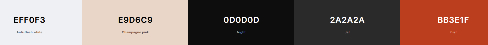
**Dark mode color pallette**
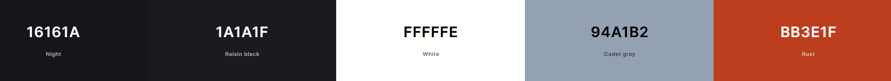

For the design and layout I took inspiration from [this youtube video](https://www.youtube.com/watch?v=g0db5kA4BfQ&list=PL1abJ21nmMp82I9AUCc0ZKEe5NVgNyWGt&index=1&t=177s).

The font used on the whole page was [Roboto from google fonts.](https://fonts.google.com/specimen/Roboto)

## User stories

1. As a new user of the page I want clear navigation to make it easy to find what I'm looking for 
2. As a vision impaired user I want a website with high contrast colors to make it easier to read 
3. As a mobile user I want a website that is responsive and easy to navigate on mobile 
4. As a desktop user I want a website that is responsive and easy to navigate on desktop 
5. As a visually impaired user I want a website that can easilly be accessed with a screen reader 
6. As a light sensitive user I want a dark mode to be easier on the eyes

7. As an enthusiast looking for a new pet I want a website where I can adopt a leopard gecko from a responsible source with easy contact options
8. As someone who wants to know how to care about a leopard gecko I want a site where I can find easy guides
9. As someone who has found an abandoned leopard gecko I want to find information on what to do now 
10. As someone who has found an abandoned leopard gecko I want to be able to easily contact a rescue as I do not have the ability/time to care for it myself 
11. As someone who can no longer care for my leopard gecko I want a way to easily contact a place where I can be sure it will be taken care of properly 

12. As the owner I want my website that displays all the geckos for adoption to heighten the chances of a rehoming 
13. As the owner I want my website to have easy to understand care guides for everyone to reduce the amount of people mistreating their pet 
14. As the owner I want my website to have easy ways to contact us for our services 
15. As the owner I want my website to immediately be clear what and who we are to users
16. As the owner I want a page that describes out purpose and mission

## Features

### Sitewide

**Lightmode/Darkmode**

The site has a light and dark mode depending on the users preferences set in their settings. Both modes have high contrast colors

User stories covered: 6, 2

**Fully responsive navbar**

The navbar is fully responsive. It scales with the site and when there's too little space it turns into a hamburger menu
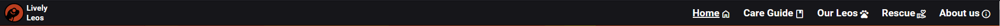

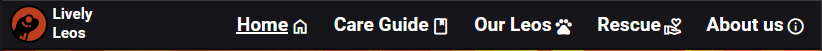

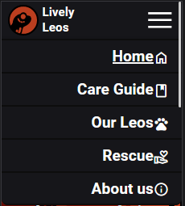

User stories covered: 1, 3, 4

**Hover effects on navitems**

The navigation items have a fancy little hover effect

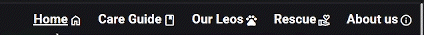

User stories covered: none

**Fully responsive footer with social media links, contact info and location**
The footer is fully responsive. On Desktop the info will show as two columns while on mobile it will show as two rows

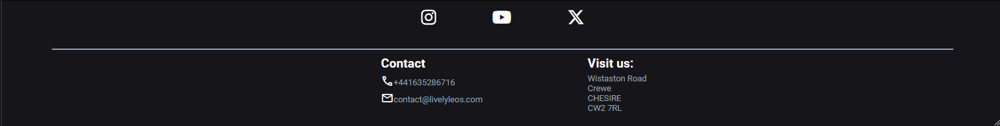

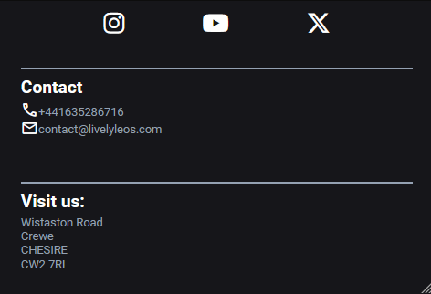

User stories covered: 3, 4, 14

**Social media hover effects**

Simple hover effect on the social media links

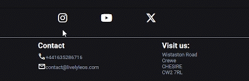

User stories covered: none

### Home page

**Hero that states the purpose of the website**

It is immediately clear what the site is about. The hero also links to another page where you can read more

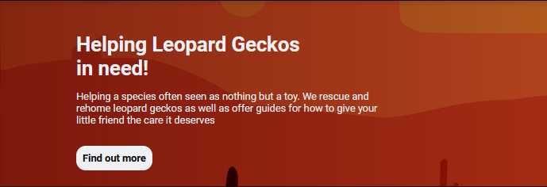

User stories covered: 15

**Redirect buttons of the 3 most important features**

The three most important features are displayed on the home page to make it even clearer what the site offers

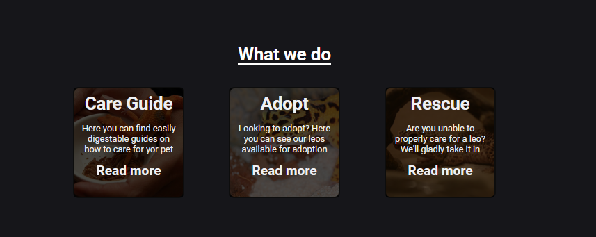

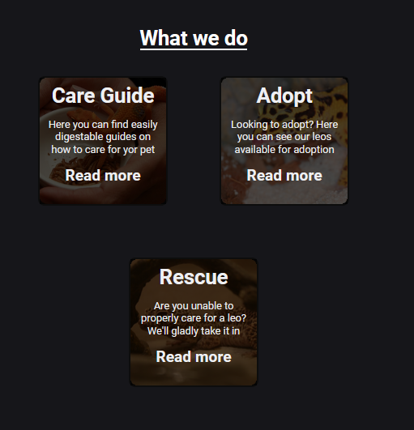

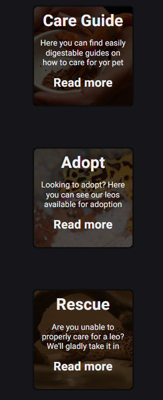

User stories covered: 1, 15

**An about us summary**

A small sumamry of what the rescue is about as well as a redirect link

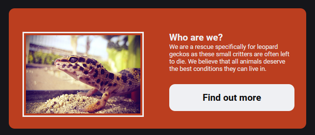

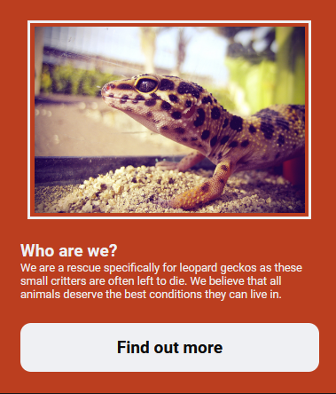

User stories covered: 15

### Care Guide page

**Animated list of links to jump to a specific section**

The links are used to jump to a specific section of the care guide page.

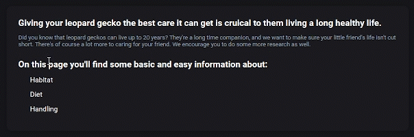

User stories covered: 1

**Sections that adapt to the content**

The sections are completely adaptable to the content inside. On desktop the image has a float right property making the text wrap around it. On mobile the image will show on top of the text

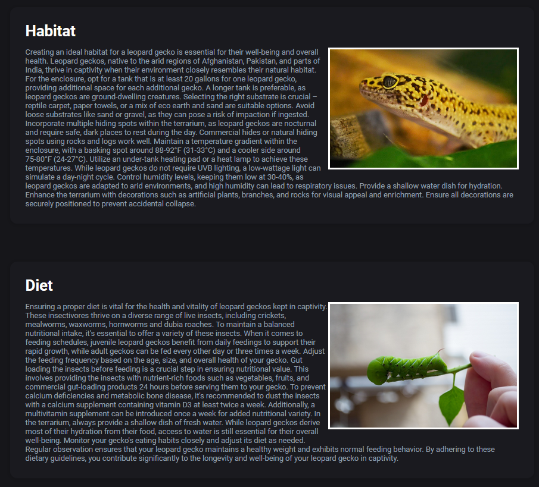

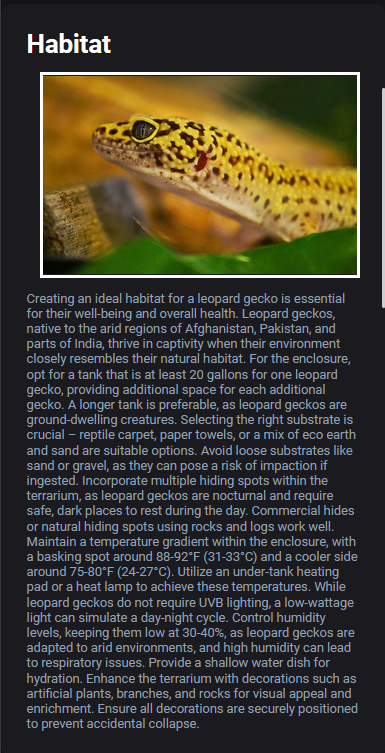

User stories covered: 8

### Our Leos page

**Sections with information on a specific leopard gecko**

The section features an image, 4 labels and a paragraph. The labels display quick information about the gecko and is fully responsive

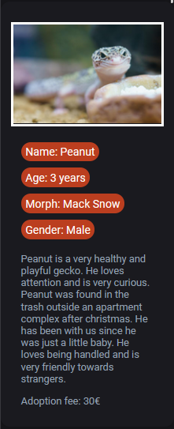

User stories covered: 7

**Contact Form**

The 'Our leos' page has a contact form that redirects to a confirmation page. 

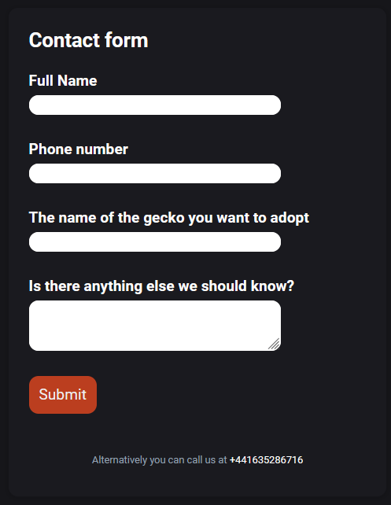

User stories covered: 7, 14

### Rescue page 

**Text container with information**

The page has two text containers with information on what to do if you've found an abandoned leopard gecko/can't care for one anymore

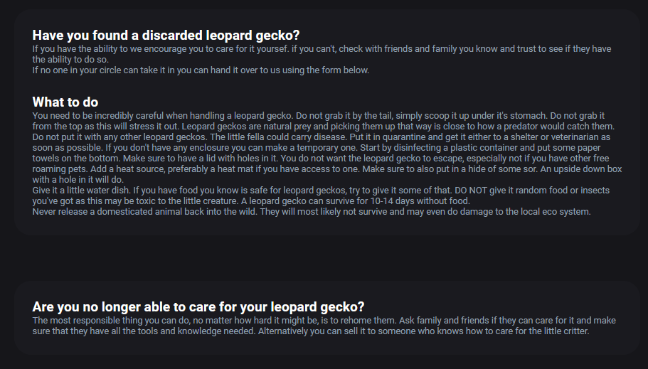

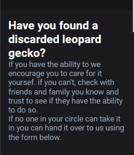

User stories covered: 9

**Contact Form with custom radio buttons**

The contact form has custom radio buttons with a small animation as well

User stories covered: 10, 11

### About us page

**Information about the rescue**

The logo is placed at the bottom to strengthen the fact that the about page is related to the lively leos rescue

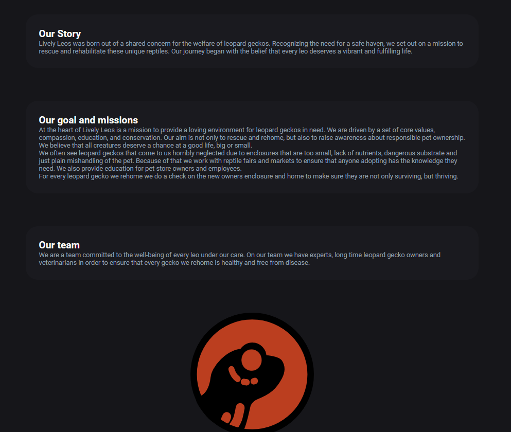

User stories covered: 16

### Other

**404 page**

The website has a 404 page implemented. Here is a button to take you back to the home page. It works on github pages.

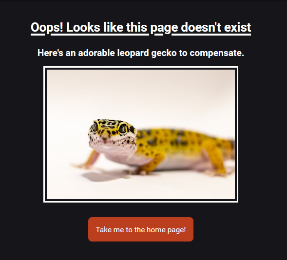

**Form confirmation page**

Whenever a form is submitted the page will redirect here. Here is a button to take you back to the home page.

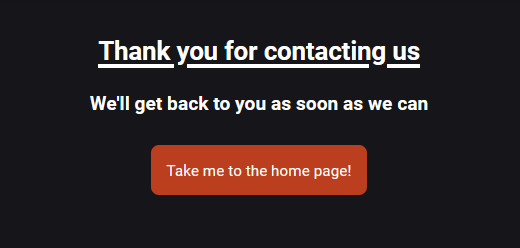

## Bugs and fixes

| Bug  | Fix |
| ------------- | ------------- |
| Icons not aligning with text in the navbar  | Make class to apply to those icons with a vertical align to the bottom  |
| Logo text not aligning properly to the left  | Remove "space between" and align the navbar items to the right instead of having the whole navbar be spaced evenly |
| Footer Divs not lining up | Remove display grid and use flex instead|
| Trailing slash in a stylesheet reference link throwing a validation error| Remove the slash|
| Hamburger menu not being the right color as it is black which causes issues on dark mode | Specify color as the heading color variable|
| Icons not showing up after using find and replace | Replace the broken header and footer by copying it from another html file |
| Headings on top of images are black on ligt mode | Modify "lined_heading" class and add "white" class to the elements|

## Technologies and tools
**Languages**
- HTML
- CSS

**Tools**
- Git/github
- Visual Studio Code
- Google Fonts
- Google Fonts Icons
- Font Awesome
- Figma
- Inkscape
- Real Favicon Generator
- Happy Hues
- Firefox dev tools
- Chrome dev tools (Briefly)

## Wireframes

Home

Guide

Our Leos

Rescue

About

## Validation and testing
**HTML**

HTML index Validation results (no errors)

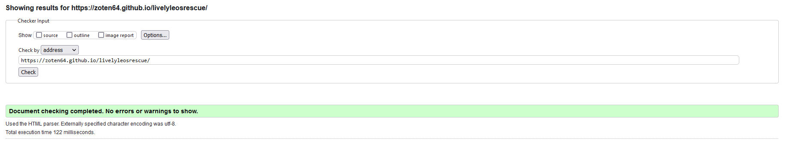

HTML care guide Validation results (no errors)

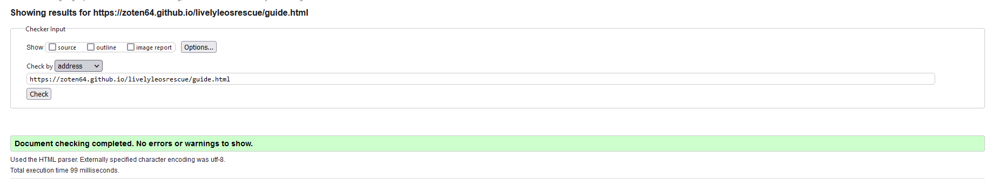

HTML our leos Validation results (no errors)

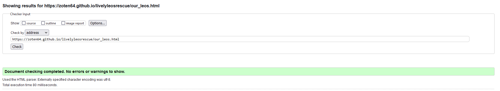

HTML rescue Validation results (no errors)

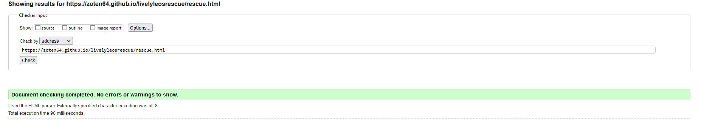

HTML about us Validation results (no errors)

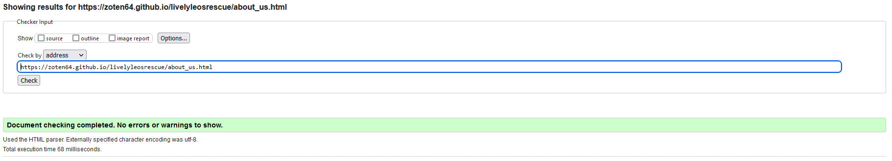

 

**CSS**

CSS URL validation results (no errors)

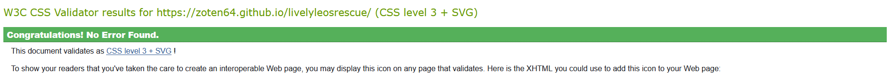

Style.css Validation results (no errors)

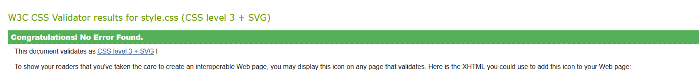

 

**Wave accessibility**

Wave accessibility validation home page

Wave accessibility validation guide page

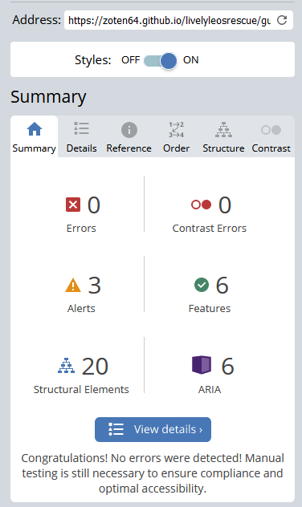

Wave accessibility validation our leos page

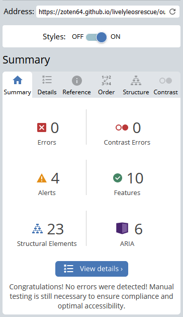

Wave accessibility validation rescue page

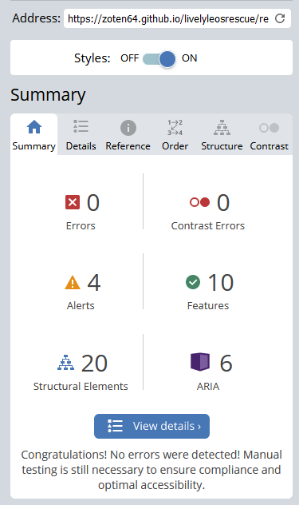

Wave accessibility validation about us page

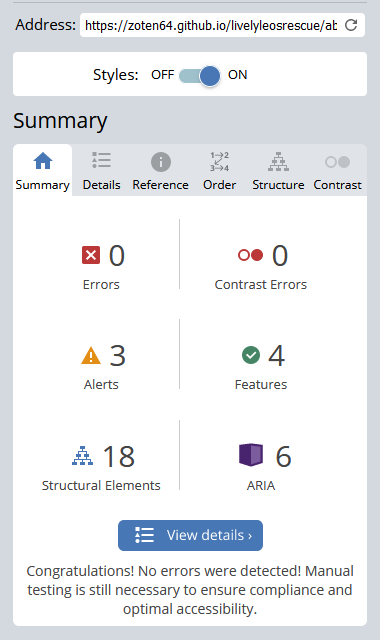

 

**Lighthouse performance**

Lighthouse test of the "home" page

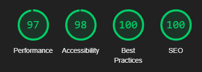

Lighthouse test of the "care guide" page

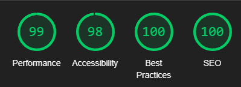

Lighthouse test of the "our leos" page

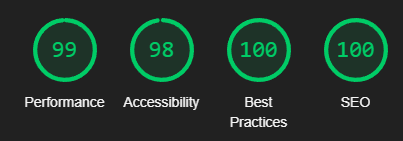

Lighthouse test of the "rescue" page

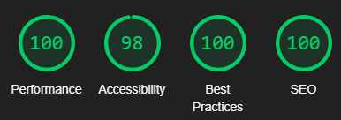

Lighthouse test of the "about us" page

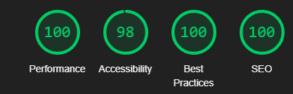

 

**Other tests**
 
- I have tested the website using both firefox and chrome
- I have tested the website on my own phone to make sure everything runs smoothly there
- I have used dev tools to make sure everything is responsive and looks good on all reasonable sizes
- I have used firefox dev tools to make sure everything looks as it should on both light and dark mode
- I have used firefox dev tools to simulate various types of color blindness
- I have used firefox to check the tabbing order for those who use keyboard to navigate

 

**Browsers tested**

- Mozilla Firefox
- Google Chrome
- Microsoft Edge

In theory the website should work across all chromium based browsers

 

**Testing Devices**

The website has been tested on the following devices:
- Custom built desktop pc
- Nothing Phone 2
- Microsoft surface pro
- HP probook

 

**Testing user stories**

1. As a new user of the page I want clear navigation to make it easy to find what I'm looking for 

| Feature  | Action | Expected results | Actual results |
| ------------- | ------------- | ------------- | ------------- |
| A navigation bar | On mobile click the hamburger menu to bring up the navigation menu, on desktop navigate to the right corner | A working navigation bar | Works as expected |
| Links in the guide section | Click on any of the links in the first section on the care guide page to get to a specific section | Links will take them to the section | Works as expected|

**Navbar**

Screenshots

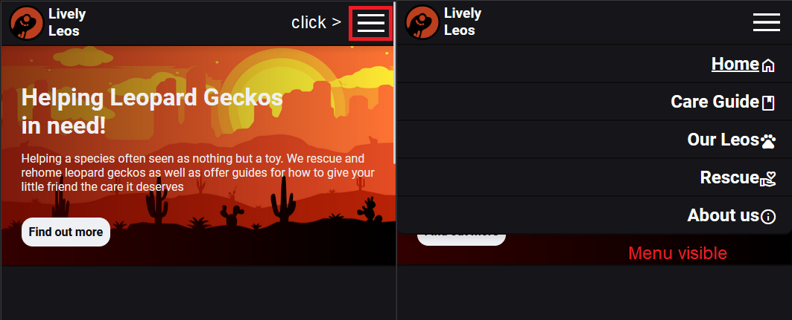
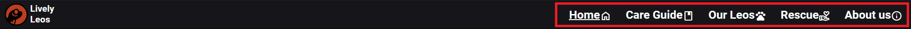

 

**Care guide links**

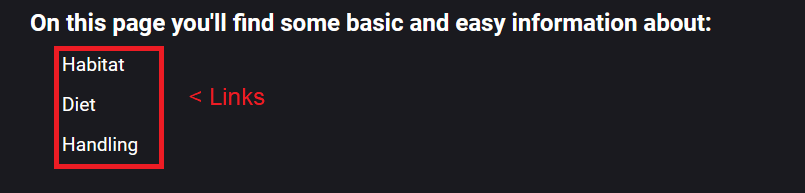

 

2. As a vision impaired user I want a website with high contrast colors to make it easier to read 

| Feature  | Action | Expected results | Actual results |
| ------------- | ------------- | ------------- | ------------- |
| A high contrast color pallette | Browse the site | An easy to read website for various color blindnesses and visual impairments | Works as expected |

Screenshots

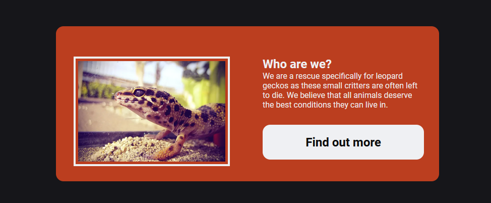
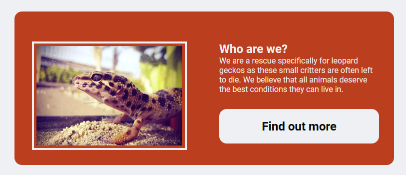

 

3. As a mobile user I want a website that is responsive and easy to navigate on mobile 

| Feature  | Action | Expected results | Actual results |
| ------------- | ------------- | ------------- | ------------- |
| Responsive mobile design | Browse the site on mobile | A responsive site that looks good on mobile devices | Works as expected |

Screenshots

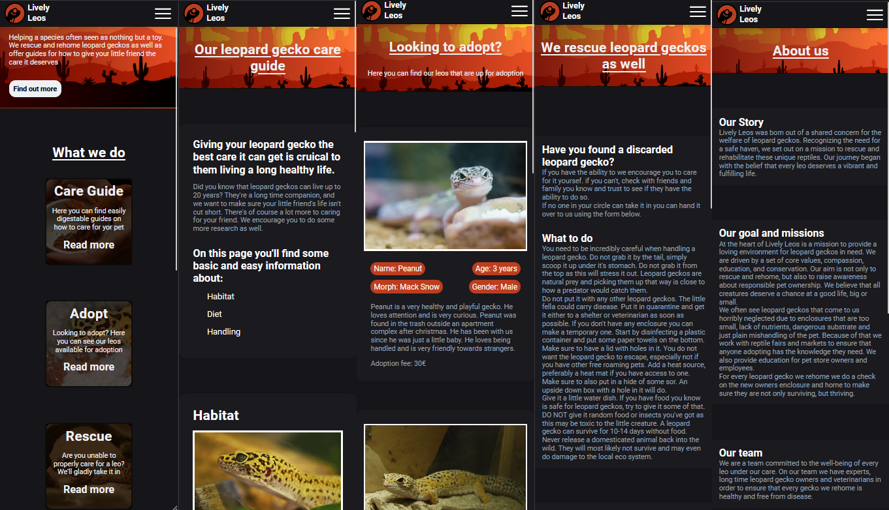

4. As a desktop user I want a website that is responsive and easy to navigate on desktop 

| Feature  | Action | Expected results | Actual results |
| ------------- | ------------- | ------------- | ------------- |
| Responsive desktop design | Browse the site on desktop | A responsive site that looks good on desktop devices | Works as expected |

Screenshots

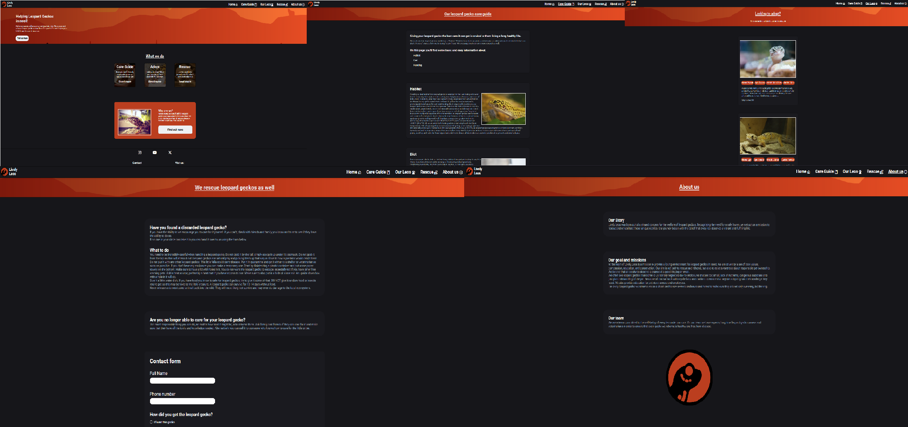

 

5. As a visually impaired user I want a website that can easilly be accessed with a screen reader 

| Feature  | Action | Expected results | Actual results |
| ------------- | ------------- | ------------- | ------------- |
| A website that follows semantic guidelines and uses alt text | Browse the site with a screen reader | An accessible website | Works as expected |

Screenshots

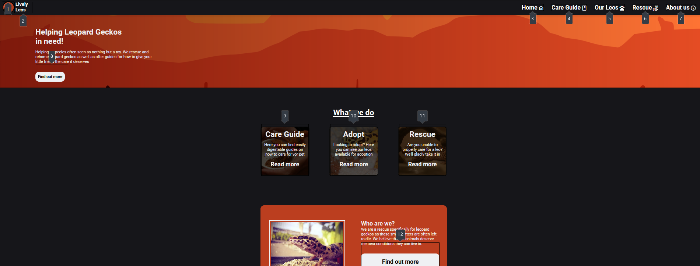

 

6. As a light sensitive user I want a dark mode to be easier on the eyes

| Feature  | Action | Expected results | Actual results |
| ------------- | ------------- | ------------- | ------------- |
| A website that automatically enabled dark mode on devices with such activated in their settings | Have dark mode activated in device settings | A website with both light and dark mode depending on the device | Works as expected |

Screenshots

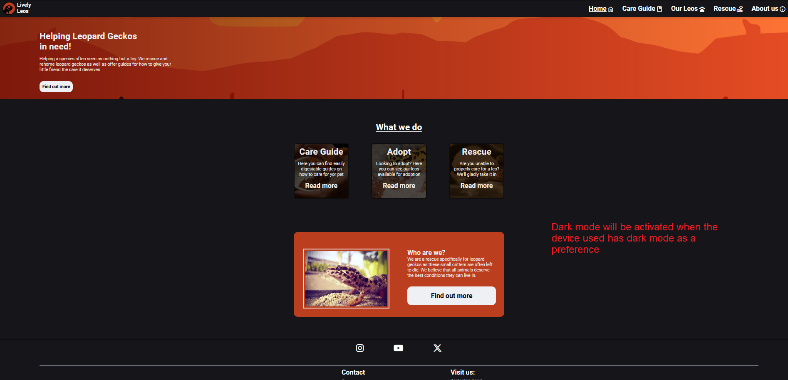

 

7. As an enthusiast looking for a new pet I want a website where I can adopt a leopard gecko from a responsible source with easy contact options

| Feature  | Action | Expected results | Actual results |
| ------------- | ------------- | ------------- | ------------- |
| A page where you can view the geckos up for adoption as well as a contact form | From the home page, navigate to "our leos". For contact scroll down to the form | A page with geckos up for adoption and a form |

Screenshots

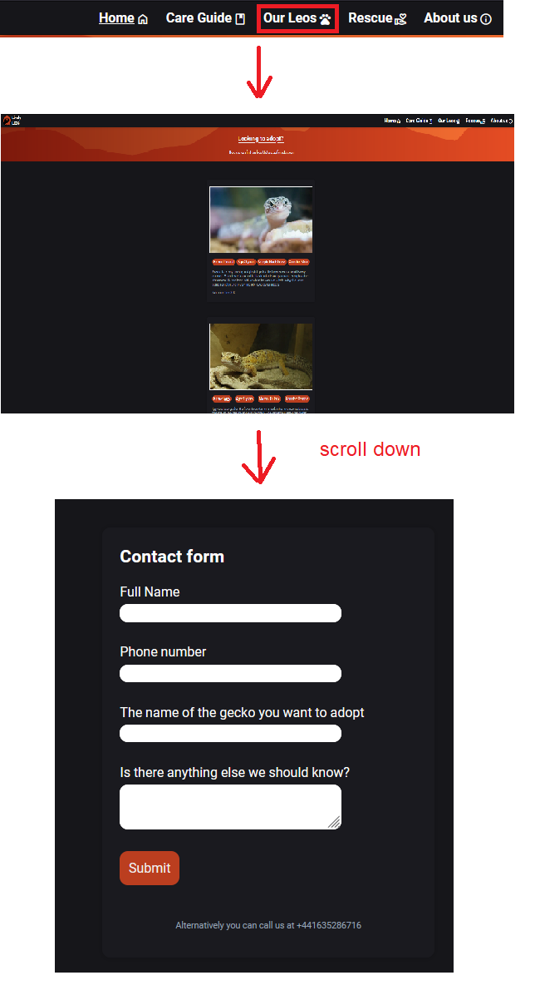

 

8. As someone who wants to know how to care about a leopard gecko I want a site where I can find easy guides

| Feature  | Action | Expected results | Actual results |
| ------------- | ------------- | ------------- | ------------- |
| A page with guides of how to care for a leopard gecko | From the home page, navigate to "Care guide" | To get to a page with care guides | works as expected |

Screenshots

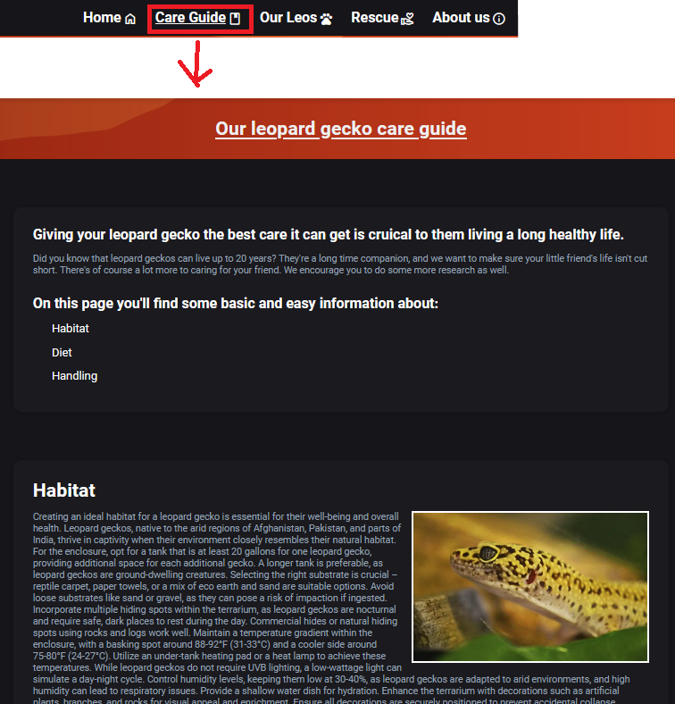

 

9. As someone who has found an abandoned leopard gecko I want to find information on what to do now 

| Feature  | Action | Expected results | Actual results |
| ------------- | ------------- | ------------- | ------------- |
| A page with some quick info on what to do | From the home page, navigate to "Rescue" | To get to a page with info on what to do if you find an abandoned leopard gecko | works as expected |

Screenshots

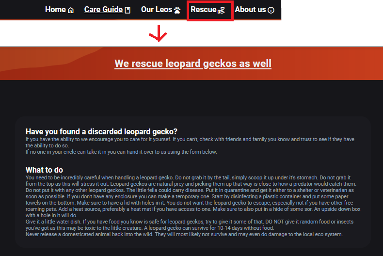

 

10. As someone who has found an abandoned leopard gecko I want to be able to easily contact a rescue as I do not have the ability/time to care for it myself 

    And

11. As someone who can no longer care for my leopard gecko I want a way to easily contact a place where I can be sure it will be taken care of properly 

| Feature  | Action | Expected results | Actual results |
| ------------- | ------------- | ------------- | ------------- |
| A page with a contact form | From the home page, navigate to "Rescue" | To get to a page with a contact form | works as expected |

Screenshots

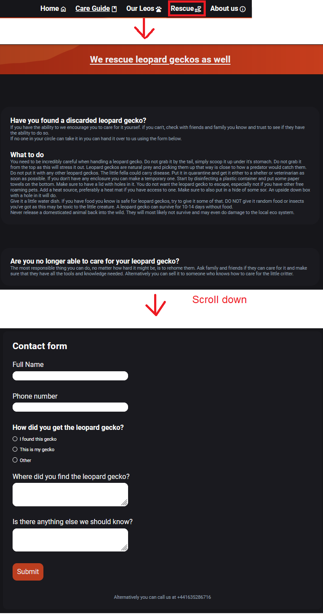

 

12. As the owner I want my website that displays all the geckos for adoption to heighten the chances of a rehoming 

| Feature  | Action | Expected results | Actual results |
| ------------- | ------------- | ------------- | ------------- |
| A page where you can view the geckos up for adoption | From the home page, navigate to "our leos". | A page with geckos up for adoption and a form |

Screenshots

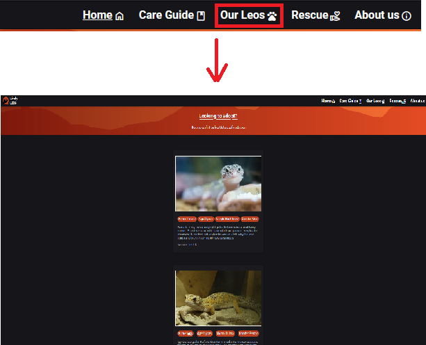

 

13. As the owner I want my website to have easy to understand care guides for everyone to reduce the amount of people mistreating their pet 

| Feature  | Action | Expected results | Actual results |
| ------------- | ------------- | ------------- | ------------- |
| A page with guides of how to care for a leopard gecko | From the home page, navigate to "Care guide" | To get to a page with care guides | works as expected |

Screenshots

 

14. As the owner I want my website to have easy ways to contact us for our services 

| Feature  | Action | Expected results | Actual results |
| ------------- | ------------- | ------------- | ------------- |
| Contact information in the footer | From any page, scroll all the way down | A footer with contact information | works as expected |

Screenshots

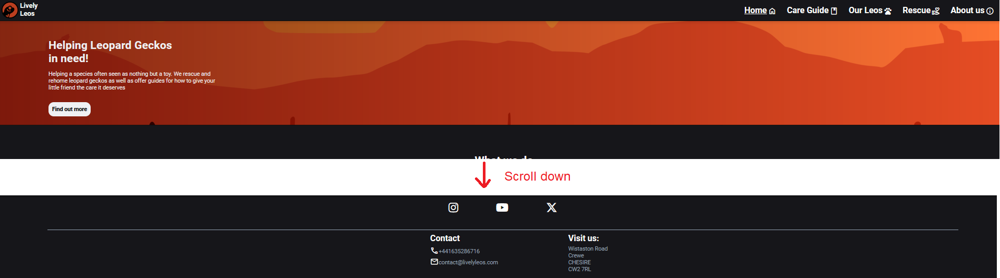

 

15. As the owner I want my website to immediately be clear what and who we are to users

| Feature  | Action | Expected results | Actual results |
| ------------- | ------------- | ------------- | ------------- |
| Short text in the hero section | Navigate to the home page | A hero image with text | Works as expected |
| A section summarizing the about section | From the home page, scroll down | A section with a short expalaination | works as expected |

Screenshots

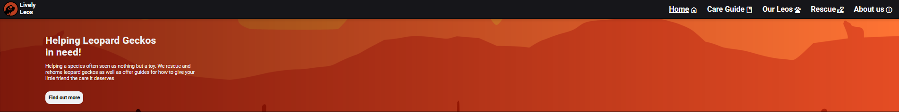

 

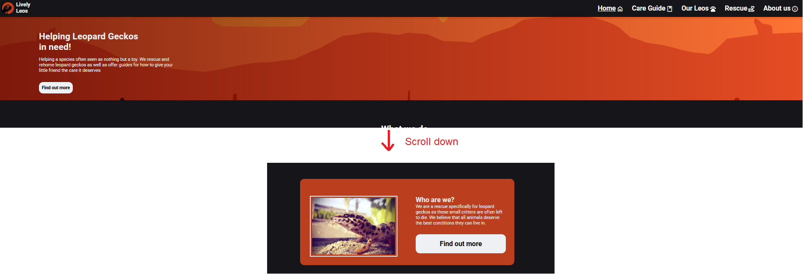

 

16. As the owner I want a page that describes out purpose and mission

| Feature  | Action | Expected results | Actual results |
| ------------- | ------------- | ------------- | ------------- |
| An about page | Navigate to the "About us" page | To arrive at an about us page | Works as expected |

Screenshots

 

## Deployment

**Deploying and accessing the website on github pages**

Deployed on github pages. [Link to website](https://zoten64.github.io/livelyleosrescue/)
The steps taken to deploy is:
- Go to the repository
- Find the settings tab
- Go to pages
- Click source and choose "Deploy from branch"
- Choose Main as the branch and click save
- Wait a few minutes while github compiles the page
- Click the link at the top of the page to go to your website

**How to fork the project**

- Navigate to the github repository (You're probably here already)
- In the right corner click fork and choose a name

**How to clone the project**

Prerequisities:

- Have git downloaded and configured

steps:

- Go to the repository (You're probably here already)
- Click the code button
- Copy the url
- Open git and change the directory to the parent directory that you want the project to clone to
- Write "git clone [the link you just copied]", in this case "git clone https://github.com/Zoten64/livelyleosrescue.git"

## Credits

**Images**

- [Hero image by Firkin on openclipart](https://openclipart.org/detail/306640/desert-at-dusk) under the [Creative Commons Zero 1.0 Public Domain License](https://creativecommons.org/publicdomain/zero/1.0/). Colors modified and vectors simplified in inkscape

- [404 Gecko image by Lucile Elville on Pexels](https://www.pexels.com/sv-se/foto/djur-odla-reptil-leopard-gecko-5475202/) (Unknown licence, [ToS here](https://www.pexels.com/license/))

- [Habitat gecko image by unknown on rawpixel](https://www.rawpixel.com/image/6023521/photo-image-public-domain-nature-free) under the [Creative Commons CC0 1.0 Deed](https://creativecommons.org/publicdomain/zero/1.0/) licence

- [Hornworm image by unknown on Pxhere](https://pxhere.com/sv/photo/773371) under the [Creative Commons Zero (CC0)](https://creativecommons.org/public-domain/cc0/) licence

- [Handling gecko image by Christopher Conde on Pexels](https://www.pexels.com/photo/close-up-shot-of-a-person-holding-a-leopard-gecko-8162439/) (Unknown licence, [ToS here](https://www.pexels.com/license/))

- [Index page gecko by Liliana Saeb on Wikimedia Commons](https://commons.wikimedia.org/wiki/File:Leopard_Gecko_%2846757940%29.jpeg) under the [Creative Commons Attribution 3.0 unported](https://creativecommons.org/licenses/by/3.0/deed.en) licence

- [Index Care Guide redirect gecko by unknown on Pxhere](https://pxhere.com/sv/photo/749123) under the [Creative Commons Zero (CC0)](https://creativecommons.org/public-domain/cc0/) licence

- [Index adopt rediect gecko by Christian von Faber-Castell on Wikimedia Commons](https://commons.wikimedia.org/wiki/File:EUBLEPHARIS-MACULARIUS_Leopard-Gecko_Leopardgecko_201705276003.jpg) under the [Creative Commons CC0 4.0 Deed](https://creativecommons.org/publicdomain/zero/1.0/) licence

- [Index rescue redirect gecko by Ryan Somma on Wikimedia Commons](https://commons.wikimedia.org/wiki/File:Leopard_Gecko,_Eublepharis_macularius.jpg) under the [Creative Commons Attribution 2.0 Generic](https://creativecommons.org/licenses/by/2.0/deed.en) licence

- [Peanut gecko on the 'our geckos' page by Pixabay on stockvault](https://www.stockvault.net/photo/236155/gecko) under the [Creative Commons CC0 1.0 Deed](https://creativecommons.org/publicdomain/zero/1.0/) licence

- [Iggy gecko on the 'our geckos' page by Kuribo on Flickr](https://www.flickr.com/photos/kuribo/2351182047) under the [Creative Commons Attribution 2.0 Generic](https://creativecommons.org/licenses/by/2.0/deed.en) licence

- [Dex gecko on the 'our geckos' page by Fungur Guy on Wikimedia Commons](https://de.wikipedia.org/wiki/Datei:Leopard_gecko_(Eublepharis_macularius),_Entomica_2.jpg) under the [Creative Commons CC0 4.0 Deed](https://creativecommons.org/publicdomain/zero/1.0/) licence

- Logo by me using clip studio paint and inkscape

**Content**

- Social media icons from [Font Awesome](https://fontawesome.com/)

- Other icons from [Google Fonts icon section](https://fonts.google.com/icons)

- Font from [Google Font](https://fonts.google.com/)

- Some colors taken from [Happy hues](https://www.happyhues.co/palettes/9), modified